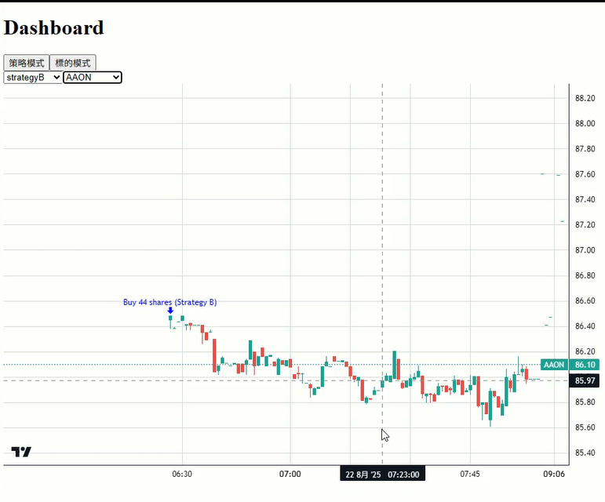
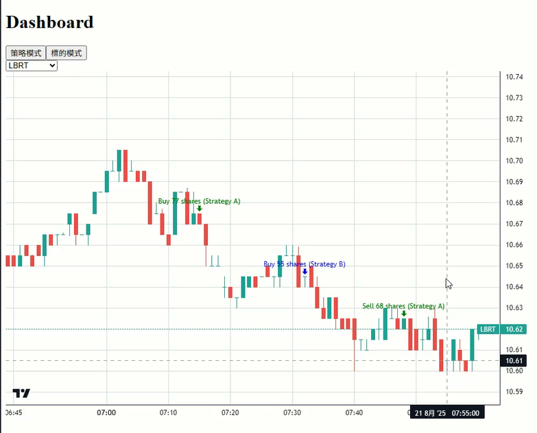

## 這是一個服務量化基金，將即時交易紀錄與即時 k 線疊加在圖表上可視化的工具

dashboard 中有按鈕可以切換不同圖表

選擇策略 based 的按鈕，會顯示此策略目前已購買的所有標的。再進一步選擇其中一個標的，就會顯示圖表。 顯示標的的即時 k 線、策略在此標的上的交易紀錄。

選擇標的 based 的按鈕，會顯示此基金目前曾購買的所有標的。再進一步選擇要觀看的標的，就會顯示此標的的即時 k 線，並將所有此基金在這 k 線上的交易紀錄都同步顯示在 k 線上 ，並標示這些交易紀錄是何策略操作的。

### strategyBasedChartExample.png:

### symbolBasedChartExample.png:

暫時都用假資料: 
# 交易紀錄資料管理
1.交易紀錄進 sqllite 本地，這樣能最快紀錄到這些資訊。 ( 因為 postgreSQL 在 server ，還需要連線，除非交易紀錄非常多筆，不然 sqlite 比較快。)
2.然後 postgre sql 定期去拉 sqlite。
3.最後畫表的時候，從 porstgre 定期拿。 在前端先進行資料處理，只把新的交易紀錄 marker 擴充進 marker 列表 ( locally changed，不用複製新變數出來 )
4.然後再 setmarker 傳進圖表上。  setMarker 還是得全圖 marker 重新繪製，這是 lightweight 畫圖套件本身的限制。

未來計畫用 rabbitmq 來處理交易所回傳確認交易的訊息，讓交易紀錄的資料可靠性上升。

# k 線資料管理
歷史資料有拉過的，就本地儲存進 sqlite。 每日更新全標的
但如果有操作 app 想畫圖表。 就去即時再更新資料。 用 alpha vantage 可以免費的抓到盡量即時的資料。 (  其他的大概都要延遲 15 分鐘 )

單表，多標的
CREATE TABLE kline (
    ticker TEXT,
    time TIMESTAMP,
    open REAL,
    high REAL,
    low REAL,
    close REAL,
    volume REAL,
    PRIMARY KEY(ticker, time)
)

